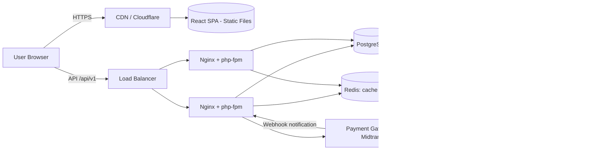
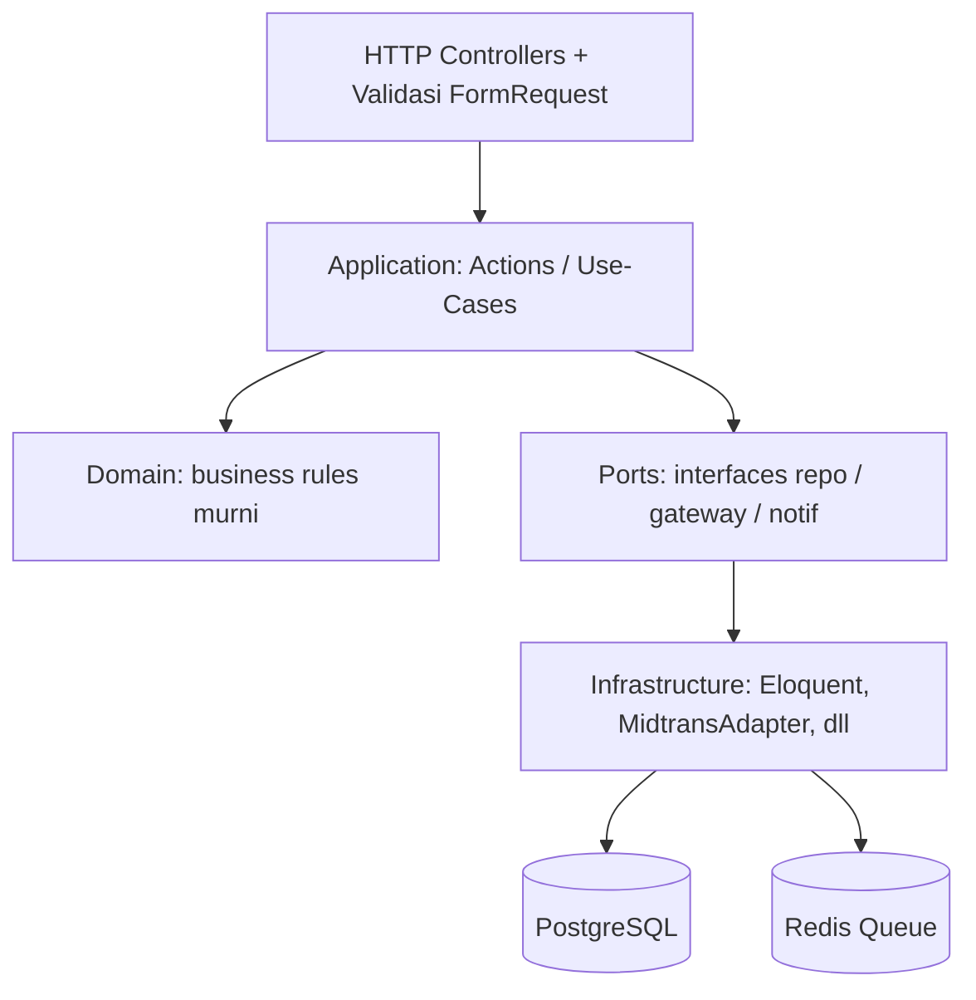
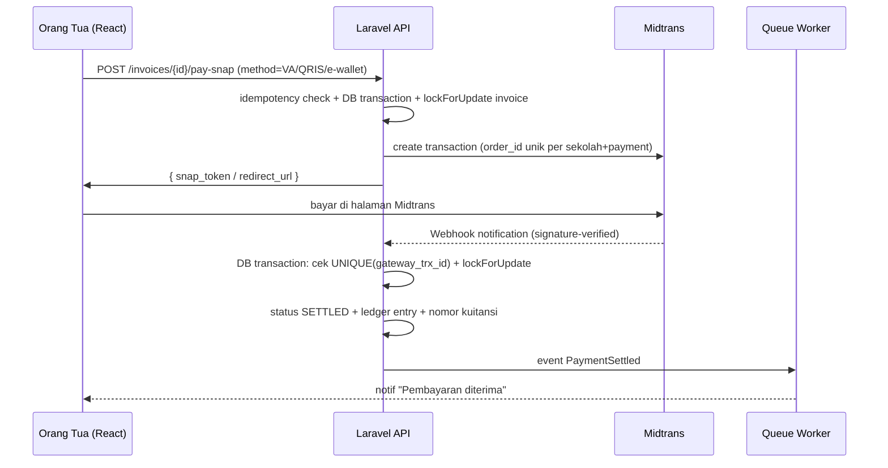

# ARCHITECTURE.md — Sistem Manajemen Keuangan Sekolah

| | |
|---|---|
| **Versi** | 1.1 |
| **Status** | Approved |
| **Tanggal** | 2026-08-28 (v1.1: adopsi fitur referensi SPP — lihat RESEARCH_SPP_REFERENCE.md) |
| **Stack** | Laravel (PHP) API · React + TypeScript + Vite SPA · PostgreSQL · Redis · Midtrans · Docker |
| **Tipe sistem** | SaaS multi-sekolah — manajemen keuangan & pembayaran sekolah |

---

## 1. Ringkasan Eksekutif

Sistem ini adalah platform **multi-sekolah (SaaS)** untuk mengelola keuangan sekolah: master tagihan (SPP, uang gedung, kegiatan), pembuatan invoice, pembayaran online via **Midtrans** maupun tunai dengan verifikasi bendahara, pembukuan, dan laporan.

Arsitektur yang dipilih adalah **Modular Monolith** — satu aplikasi backend yang terstruktur rapi menjadi modul-modul bisnis dengan batas yang ketat. Ini keputusan sadar untuk tim kecil (1–3 orang) yang menargetkan skala menengah (ratusan ribu pengguna), dengan jalur ekstraksi ke microservices *jika dan hanya jika* benar-benar dibutuhkan di masa depan.

**Tiga pilar desain:**
1. **Uang ≠ angka biasa** → transaksi idempotent, auditable, tidak bisa double-charge.
2. **Disiplin arsitektur** → Laravel "dipaksa" modular, karena default framework ini tidak modular.
3. **Siap naik kelas** → mudah scale-out, tanpa over-engineering di fase awal.

---

## 2. Konteks & Constraints

| Faktor | Kondisi |
|---|---|
| Bentuk sistem | Web app (frontend + backend) |
| Status proyek | Greenfield (dari nol) |
| Ukuran tim | Solo / sangat kecil (1–3 orang) |
| Skala target | Menengah — ratusan ribu pengguna terdaftar (CCU di orde ribuan) |
| Model bisnis | SaaS multi-sekolah |
| Constraint teknis | ❌ Larangan: Next.js sebagai backend, CodeIgniter |

---

## 3. Prinsip Desain (Design Drivers)

1. **Data keuangan adalah raja** — integrity, audit trail, dan idempotency lebih penting daripada kecepatan fitur.
2. **Sederhana dulu, naik kelas nanti** — modular monolith, jangan microservices sejak awal.
3. **API yang jelas dan sinkron** — frontend & backend decoupled total, kontrak API di-generate (OpenAPI → typed client).
4. **Business logic bebas framework** — domain murni, infrastruktur di belakang port.
5. **Sesuatu yang lambat tidak boleh memblokir request** — semua lewat queue.
6. **Multi-tenant diisolasi secara teknis, bukan lewat niat baik** — enforcement otomatis.
7. **Dokumentasi keputusan** — setiap keputusan arsitektur dicatat sebagai ADR (lihat `ADR/`).

---

## 4. Decision Log (Ringkasan)

| # | Keputusan | Pilihan | ADR |
|---|---|---|---|
| 1 | Bentuk arsitektur | Modular Monolith | [ADR-0001](ADR/0001-modular-monolith.md) |
| 2 | Backend framework | Laravel (PHP) | [ADR-0002](ADR/0002-laravel-backend.md) |
| 3 | Frontend | React + TypeScript + Vite (SPA murni) | [ADR-0003](ADR/0003-react-vite-spa.md) |
| 4 | Pemisahan FE/BE | Terpisah total (API + SPA), bukan server-rendered | [ADR-0004](ADR/0004-frontend-backend-decoupled.md) |
| 5 | Tenant model | Multi-sekolah, shared DB + `school_id` | [ADR-0005](ADR/0005-multi-tenant-shared-db.md) |
| 6 | Data store | PostgreSQL (SSOT) + Redis (cache/queue/session) | [ADR-0006](ADR/0006-postgresql-redis.md) |
| 7 | Pembayaran online | Midtrans (Snap) via pola adapter | [ADR-0007](ADR/0007-payment-gateway-adapter.md) |
| 8 | Pembukuan | Ledger append-only (immutable) | [ADR-0008](ADR/0008-ledger-append-only.md) |
| 9 | Representasi uang | Integer cents, tanpa float | [ADR-0009](ADR/0009-money-integer-cents.md) |
| 10 | Struktur domain | Pola Action (use-case per class) | [ADR-0010](ADR/0010-action-pattern.md) |
| 11 | Kontrak API | OpenAPI (scramble) + client di-generate | [ADR-0011](ADR/0011-openapi-contract.md) |
| 12 | Tugas lambat | Queue worker (Redis) | [ADR-0012](ADR/0012-async-queue.md) |
| 13 | Pembayaran aman | Idempotency + race-condition guard | [ADR-0013](ADR/0013-payment-idempotency.md) |
| 14 | Scope fase awal | Anti over-engineering (tanpa microservices/K8s/event sourcing) | [ADR-0014](ADR/0014-anti-over-engineering.md) |
| 15 | Tagihan Bulanan/Bebas | `tipe_bayar` + rincian per bulan + pivot `payment_invoice` (1 bayar → N tagihan) | [ADR-0015](ADR/0015-tagihan-bulanan-bebas.md) |
| 16 | Notifikasi WhatsApp | Adapter + queue + consent UU PDP (fast-follow) | [ADR-0016](ADR/0016-notifikasi-wa-adapter.md) |

---

## 5. Diagram Arsitektur

### 5.1 High-Level



### 5.2 Berlapis di Dalam Backend (Ports & Adapters)



**Prinsip:** lapisan dalam (Domain) **tidak boleh tahu** framework, database, atau library eksternal. Alur dependensi selalu mengarah ke dalam (`infrastructure → ports → application → domain`).

---

## 6. Struktur Kode Laravel (Modular "Paksa")

```
app/
├─ Domain/                            # ← inti bisnis, bebas dari hal teknis
│  ├─ Billing/
│  │  ├─ Actions/                     # 1 class = 1 use-case
│  │  │  ├─ CreateInvoicesAction.php
│  │  │  ├─ ProcessSnapPaymentAction.php
│  │  │  └─ VerifyManualPaymentAction.php
│  │  ├─ Models/                      # Eloquent model (BillingInvoice, Payment...)
│  │  ├─ Contracts/                   # PORT: PaymentGatewayInterface.php
│  │  ├─ Data/                        # DTO
│  │  └─ Events/                      # InvoiceCreated, PaymentSettled
│  ├─ Finance/                        # ledger, jurnal, rekonsiliasi
│  ├─ Student/
│  ├─ Auth/
│  └─ School/
├─ Infrastructure/
│  ├─ PaymentGateways/                # Adapters: MidtransGateway.php
│  ├─ Notifications/
│  └─ Repositories/
├─ Http/
│  ├─ Controllers/Api/V1/             # tipis — validasi + panggil Action
│  ├─ Middleware/                     # auth:sanctum, tenant-scope, throttle
│  ├─ Requests/                       # FormRequest (validasi)
│  └─ Resources/                      # API Resource (output shape)
├─ Console/Commands/                  # artisan schedule: invoice, reminder, reconcile
└─ ...
```

**Aturan emas (detail di `CODING_GUIDELINES.md`):**
1. Controller **tidak** berisi logika bisnis — hanya validasi + memanggil 1 Action.
2. Satu Action = satu alur bisnis yang bisa diuji mandiri.
3. Modul tidak boleh mengakses model/internal modul lain secara langsung — lewat Action atau domain event.
4. Semua angka uang dalam **integer cents**.
5. Mutasi data keuangan **selalu** melalui Action → otomatis tercatat audit & ledger.

---

## 7. Multi-Tenant (Shared DB + `school_id`)

Perlindungan isolasi tenant berlapis:

| # | Mekanisme | Keterangan |
|---|---|---|
| 1 | **Global Scope Eloquent** | Semua query model domain otomatis tersaring `school_id` |
| 2 | **Middleware `EnsureSchoolContext`** | `school_id` diambil dari user login/konteks aktif, **bukan** dari body/param (anti-spoof) |
| 3 | **Unique constraint gabungan** | `UNIQUE(school_id, ...)` di semua tabel domain — mencegah data silang di level database |
| 4 | **Policy & FormRequest** | Validasi akses per resource |
| 5 | **Test isolasi** | Dijamin oleh test: "user sekolah A tidak dapat membaca data sekolah B → error" |

**User multi-sekolah:** pivot `school_user` + role per sekolah (`spatie/laravel-permission`). Satu orang tua dengan anak di 2 sekolah: login → pilih konteks sekolah aktif → token Sanctum menyimpan `school_id` aktif.

**Super admin platform** (khusus tim internal) untuk onboarding sekolah baru — akses lintas tenant dipisah role + audit log sendiri.

---

## 8. Alur Pembayaran Online (Midtrans Snap)



**Aturan integrasi:**
- `order_id` dibentuk `SCH{n}.{yyyyMMdd}.{paymentId}` → mapping ke sekolah + pembayaran.
- Verifikasi `signature_key = sha512(order_id + status_code + gross_amount + ServerKey)` — **selalu dicek**.
- Idempotent: `UNIQUE(gateway_trx_id)` → webhook ganda/retry tidak memproses dua kali.
- Nominal dibaca dari **response gateway** dan direkonsiliasi dengan `gross_amount` — tidak pernah percaya input client.
- **Rekonsiliasi harian** (scheduled): cocokkan settlement laporan Midtrans vs ledger lokal → early warning selisih.
- Konfigurasi per sekolah disimpan di `school_gateway_configs` (merchant key di-enkripsi) → siap memakai akun Midtrans per sekolah (settlement ke rekening masing-masing sekolah).

---

## 9. Alur Pembayaran Tunai (Manual + Verifikasi)

```
Bendahara/petugas mencatat pembayaran tunai + upload bukti
  → status: PENDING_VERIFICATION (belum diakui sebagai lunas)
Bendahara lain (pemisahan tugas maker-checker) verifikasi bukti + nominal
  → DB transaction: lock invoice → cek belum lunas → settle
  → ledger entry + kuitansi + audit verified_by/verified_at
  → notifikasi ke orang tua: "Pembayaran diterima"
Bila ditolak → catat alasan + notifikasi
```

**Aturan `maker-checker`:** pencatat ≠ verifikator. Satu orang tidak boleh mencatat lalu memverifikasi transaksinya sendiri.

---

## 10. Data Model Inti

```
schools ─┬─ school_gateway_configs (1:1, merchant key terenkripsi)
         ├─ school_user (pivot) ─ users ─ roles (spatie/laravel-permission)
         ├─ academic_years (tahun + semester) ─ classes ─ students
         ├─ students ──< guardians (pivot many-to-many; guardian: no_hp, notif_consent_at)
         ├─ bill_types (Jenis: SPP/gedung/kegiatan, tipe_bayar: monthly|one_time, tarif_cents)
         ├─ invoices (school_id, student_id, bill_type_id,
         │            periode_bulan, periode_tahun,      # monthly per bulan; one_time: bulan NULL
         │            amount_cents, status: OPEN/PARTIAL/PAID/VOID,
         │            UNIQUE(school_id, student_id, bill_type_id, periode_bulan, periode_tahun))
         ├─ payment_invoice (pivot: payment_id ⇆ invoice_id, allocated_cents)  # 1 bayar → N tagihan
         ├─ payments (method: CASH/SNAP, gateway_trx_id UNIQUE,
         │            status: PENDING/PENDING_VERIFICATION/SETTLED/FAILED/REFUNDED,
         │            total_cents, proof_path, created_by, verified_by, verified_at, cashier_name)
         ├─ ledger_entries (APPEND-ONLY: school_id, ref_type/ref_id,
         │            debit_cents, credit_cents, note, created_by)
         ├─ receipt_sequences (school_id, year, last_number)  ← kuitansi
         ├─ receipts (number UNIQUE per school+year, payment_id)
         ├─ notification_logs (guardian_id, channel, template, phone, status, provider_ref)
         ├─ audit_logs (subject, actor, before/after JSON, ip, ua)
         └─ settings (per sekolah: nama, alamat, kebijakan, dst)
```

Catatan: `ledger_entries` bersifat **append-only** — tidak ada UPDATE/DELETE. Koreksi dilakukan dengan *reversing entry*, bukan mengubah baris lama (lihat ADR-0008).

---

## 11. Kontrak API (Ringkasan)

| Method & Path | Fungsi | Catatan keamanan |
|---|---|---|
| `POST /api/v1/auth/login` | Login (email + password) | rate-limit ketat, audit login gagal |
| `POST /api/v1/auth/logout` · `GET /me` | Sesi | Sanctum token scope per role |
| `GET/POST /api/v1/students` | CRUD murid + guardian | Konteks sekolah aktif |
| `POST /api/v1/invoices/generate` | Generate tagihan batch | Role tertentu; batch besar → queue |
| `GET /api/v1/invoices?student_id=&status=` | Daftar tagihan | Hanya milik sendiri |
| `POST /api/v1/invoices/{id}/pay-snap` | Buat transaksi Midtrans | Idempotency-Key + lock invoice |
| `POST /api/v1/payments/manual` | Catat tunai + bukti (bisa alokasikan ke N tagihan) | Role bendahara |
| `POST /api/v1/payments/{id}/verify` | Verifikasi tunai | Role bendahara ≠ created_by |
| `POST /api/v1/webhooks/midtrans` | Callback gateway | Tanpa auth token, **verifikasi signature** |
| `GET /api/v1/reports/tunggakan?kelas=&tahun_ajaran=` | Sisa tagihan per siswa | Filter kelas/tahun ajaran |
| `GET /api/v1/reports/{type}?format=pdf|xlsx` | Laporan per siswa/kelas/sekolah | Export PDF/CSV via queue |
| `PATCH /api/v1/guardians/{id}/notification-consent` | Opt-in/out notifikasi ortu | Wajib utk kirim WA (UU PDP) |

Semua endpoint: rate limit (`throttle`), validasi `FormRequest`, output via `API Resource`, spek **OpenAPI di-generate** (package `dedoc/scramble`) → client React di-generate dari spec tersebut agar selalu sinkron.

---

## 12. Arsitektur Frontend (React SPA)

```
src/
├─ app/            # routing (React Router + guard role), providers, layout
├─ features/       # auth, students, billing, payments, reports
├─ components/ui   # design system (Button, Table, Modal, ...)
├─ api/            # client di-generate dari OpenAPI (types aman)
├─ hooks/          # wrappers TanStack Query
└─ lib/            # utils (format Rupiah dari cents — satu util sentral)
└─ main.tsx
```

- **Server state:** TanStack Query. **UI state:** Zustand (tipis).
- Format mata uang **hanya** lewat 1 util sentral (cents → Rupiah) — tidak ada format tersebar.
- Static file di-deploy ke CDN; hanya bicara ke backend lewat `/api/v1`.

---

## 13. Infrastruktur, CI/CD & Observability

### Fase 1 (MVP)
```
GitHub Actions: pest test → build → deploy
1 VPS + Docker Compose:
  nginx → php-fpm (app) → queue worker -- redis → postgres
  scheduler (cron): schedule:run
Secrets: env di server/CI — tidak pernah di git
Health: GET /healthz (cek DB + Redis + queue) → uptime monitor
Error: Sentry (backend + frontend) → alert grup
Backup: pg_dump harian + test-restore bulanan (bukan sekadar cadangan)
```

### Scheduler (cron job)
| Waktu | Tugas |
|---|---|
| Tanggal 1 | Generate invoice SPP (batch, chunked, transaction per siswa) |
| H-3 / H-1 / H+3 | Reminder jatuh tempo (WA/email via queue) |
| Harian 03:00 | Rekonsiliasi settlement Midtrans vs ledger |

### Fase berikutnya (saat benar-benar diperlukan)
Managed PostgreSQL, read replica, autoscale instance, CDN global, feature flags.

---

## 14. Roadmap Pengerjaan (tim 1–3 orang)

```
Fase 0 — Fondasi (minggu 1–2)
  ├ repo mono: app/ (Laravel) + web/ (React) + docker-compose + CI + lint/format
  ├ struktur modular Laravel + test Pest + kerangka Actions
  └ scaffold React + OpenAPI client generate jalan end-to-end

Fase 1 — Inti keuangan (minggu 3–6)
  ├ Auth + RBAC (admin/bendahara/wali kelas/murid/orang tua)
  ├ master sekolah, tahun ajaran, kelas, murid, guardian
  ├ master tagihan → generate invoice → bayar tunai + verifikasi + kuitansi
  └ laporan dasar (per siswa, per kelas, per periode)

Fase 2 — Pembayaran online (minggu 7–10)
  ├ integrasi Midtrans Snap + webhook + idempotency
  ├ rekonsiliasi harian
  └ reminder & notifikasi otomatis

Fase 3 — Penyempurnaan (bertahap)
  ├ dashboard bendahara & super admin, ekspor laporan
  ├ autoscale, CDN, managed Postgres, konfigurasi per sekolah lanjutan
```

---

## 15. Yang Sengaja TIDAK Dilakukan di Fase 1

✗ Microservices ✗ Kubernetes ✗ Event sourcing / CQRS penuh ✗ Multiple database ✗ AI/ML

Semua itu keputusan *nanti*, hanya jika data & user benar-benar menuntut. Fokus fase awal: **fitur benar, uang aman, kode rapi.**

---

## 16. Prasyarat Dunia Nyata (Non-Technical)

1. **Akun Midtrans** (bisnis/individu) — perhatikan alur onboarding & settlement ke rekening sekolah.
2. **1 VPS** (mulai kecil; ±Rp150–300rb/bulan).
3. **1 domain** + SSL (Let's Encrypt gratis).

---

## 17. Referensi

- Keputusan detail: lihat folder [`ADR/`](ADR/) — setiap keputusan arsitektur besar didokumentasikan di sana.
- Aturan implementasi: lihat [`CODING_GUIDELINES.md`](CODING_GUIDELINES.md).
- Riset fitur SPP dari repo referensi & adopsinya: [`RESEARCH_SPP_REFERENCE.md`](RESEARCH_SPP_REFERENCE.md).