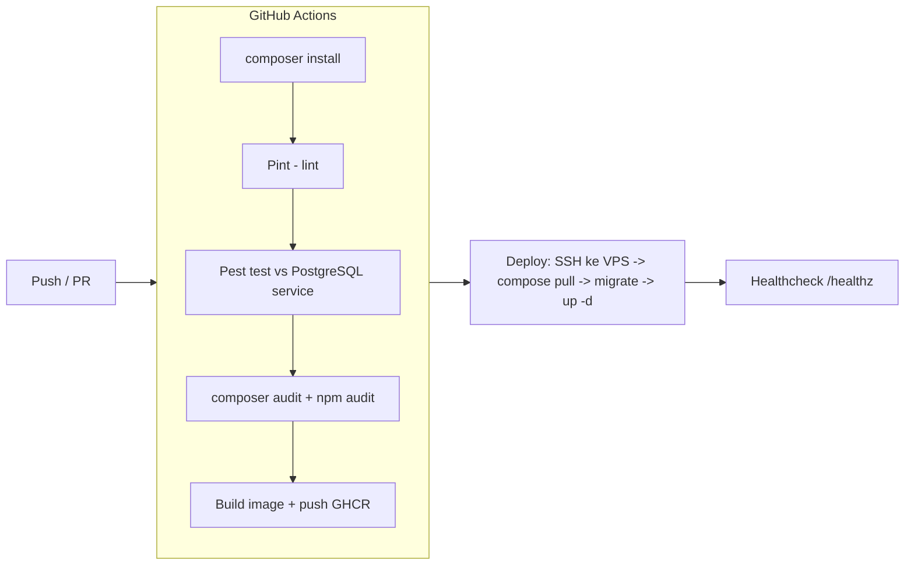

# DEVOPS.md — Desain & Operasional DevOps (Fase 1)

| | |
|---|---|
| **Versi** | 1.0 |
| **Status** | Active |
| **Tanggal** | 2026-08-28 |
| **Target** | 1 VPS (Ubuntu 24.04 LTS) · Docker Compose · GitHub Actions · Let's Encrypt |
| **Referensi** | [ARCHITECTURE.md](ARCHITECTURE.md) · [SECURITY.md](SECURITY.md) · [PROJECT_PLAN.md](PROJECT_PLAN.md) |

---

## 1. Prinsip DevOps

1. **Reproducible** — lingkungan dibuat dari kode (`compose` + `Dockerfile`), bukan menitipkan memori.
2. **Immutable artifact** — image di-build & di-test di CI; yang di-deploy ke produksi adalah **image yang sama**, bukan build ulang di server.
3. **Least privilege** — user deploy dengan akses seminimal mungkin; DB/Redis tidak expose publik.
4. **Observable** — healthcheck, monitoring, log terstruktur; kita tahu sistem hidup sebelum user mengeluh.
5. **Backup yang terbukti** — cadangan tanpa uji-restore = bukan cadangan.
6. **Rollback siap** — setiap deploy punya jalur balik (pin image tag).

---

## 2. Topologi Infra Fase 1

```mermaid
flowchart LR
    U[Internet] --> FW[UFW: 22, 80, 443 only]
    FW --> NG[Nginx (TLS + reverse proxy + rate limit)]
    NG --> APP[Laravel php-fpm]
    APP --> PG[(PostgreSQL 16)]
    APP --> RD[(Redis 7)]
    RD --> WK[Queue Workers]
    RD --> SC[Schedule / cron]
    PG --> BK[(Backup pool: pg_dump harian, terenkripsi)]
```

**Spesifikasi VPS minimal (rekomendasi):** 4 vCPU / 8 GB RAM / 100 GB SSD — biarkan headroom untuk PHP+Postgres+Redis; mulai dari 2 vCPU/4 GB bila budget ketat, naikkan bila perlu.

**Network Docker:** `frontend` (nginx) dan `backend` (app, worker, scheduler, postgres, redis). **Hanya nginx yang punya akses internet keluar-masuk port 80/443.** Postgres/Redis berada di network `backend` semata, tidak ada port ke host.

---

## 3. Bootstrap Server (Checklist, dijalankan satu kali)

```bash
# 1. SSH sebagai root sekali
ssh root@<SERVER_IP>
adduser deploy && usermod -aG sudo deploy     # user non-root
mkdir -p /home/deploy/.ssh && cp ~/.ssh/authorized_keys /home/deploy/.ssh/
chown -R deploy:deploy /home/deploy/.ssh && chmod 700 /home/deploy/.ssh && chmod 600 /home/deploy/.ssh/authorized_keys

# 2. Hanya SSH key, matikan root & password
#    /etc/ssh/sshd_config: PasswordAuthentication no, PermitRootLogin no
systemctl restart ssh

# 3. Firewall
ufw allow OpenSSH && ufw allow 80/tcp && ufw allow 443/tcp && ufw enable

# 4. Keamanan dasar
apt update && apt install -y fail2ban unattended-upgrades docker.io docker-compose-v2
fail2ban-client set sshd enabled true        # ban IP brute-force

# 5. (Dari laptop kamu, bukan di server) deploy user punya akses git/docker
#    Tambahkan "deploy" ke grup docker HANYA bila perlu; alternatif lebih aman: sudo via visudo untuk `docker compose` scoped.
```

> ⚠️ **Catatan keamanan:** jangan pernah membuka port 5432 (Postgres) / 6379 (Redis) ke publik. Semuanya internal Docker. Jangan login sebagai root secara rutin — selalu `deploy`.

---

## 4. CI/CD Pipeline



**Tahapan CI (`deploy/../.github/workflows/ci.yml`):**
1. **Backend:** PHP 8.3 + extension `pdo_pgsql` → `composer install` → Pint (cek format) → **Pest test** menggunakan PostgreSQL 16 + Redis sebagai service (bukan SQLite — karena prod pakai Postgres, test wajib di Postgres) → `composer audit`.
2. **Frontend:** Node 20 → `npm ci` → ESLint → `npm run build` (type-check TS strict).
3. **Image:** build `app` → push ke **GHCR** dengan tag `sha-<short>`; produksi men-deploy tag tersebut.
4. **Deploy (push ke `main`):** SSH dengan key dari GitHub Secrets → `docker compose pull` → backup DB otomatis sebelum migrate → `php artisan migrate --force` → `up -d` → cek `/healthz`.

**Rollback:** cukup ganti `.env` `APP_IMAGE_TAG` ke tag sebelumnya → `docker compose up -d`. Karena image di-pin per tag, rollback = 1 perintah.

---

## 5. Secrets Management

- `.gitignore` WAJIB berisi `.env`, `.env.production`, `*.pem`.
- `.env` produksi dibuat **hanya di server** (dari `.env.example`), nilai diisi manual/SSH — tidak pernah lewat git.
- GitHub Secrets: `SSH_PRIVATE_KEY`, `GHCR_TOKEN`, `APP_KEY` (bila perlu).
- Laravel `APP_KEY` generate: `php artisan key:generate` (di server).
- Gateway/prosesor keys nanti (fast-follow) → kolom **encrypted** di DB (ADR-0007) + `APP_KEY` sebagai master.

---

## 6. Backup & Recovery

**Kebijakan (target MVP):** RPO ≤ 24 jam · RTO ≤ 4 jam.

| Aspek | Nilai |
|---|---|
| Frekuensi | Harian 02:00 WIB (`pg_dump` + gzip) + bulanan arsip |
| Enkripsi | Ya (script `deploy/backup.sh` mendukung `age`/GPG bila key disetel) |
| Retention | 30 hari harian + arsip bulanan tersimpan |
| Offsite | Salin berkala ke objek storage (S3-compatible) bila tersedia |
| Uji restore | **Bulanan wajib** — restore ke container uji, cek jumlah baris & integrity |

**Walau Redis dipakai cache/queue, data persist-nya (`appendonly`) juga di-backup** → dipulihkan bila server hangus (queue job hilang = wajar, re-dispatch dari trigger).

---

## 7. Monitoring, Logging & Alerting

| Alat | Fungsi | Biaya |
|---|---|---|
| `GET /healthz` | Cek DB + Redis + queue sehat | gratis (built-in) |
| UptimeRobot / Uptime Kuma | Monitor uptime 443 → alert ke Telegram | gratis |
| Sentry | Error backend (PHP) + frontend (JS) → trace + alert | free tier |
| Structured JSON log | Laravel log ke JSON, mudah difilter | gratis |
| Alert | Telegram/WhatsApp webhook → grup owner | gratis |

**Yang dipantau:** healthz (5 menit), failed jobs queue, error Sentry, disk usage (`df -h` mingguan/alert), sertifikat TLS kedaluwarsa (Uptime Kuma).

---

## 8. Runbook Esensial (Jangan panik)

```bash
# Cek kesehatan
curl -s https://<domain>/healthz | jq .            # pastikan {"status":"ok"}

# Lihat log aplikasi
docker compose logs --tail=200 app
docker compose logs --tail=100 -f worker

# Restart worker yang macet (queue)
docker compose restart worker
php artisan queue:retry all        # retry job gagal

# Scheduler jalan?
docker compose logs --tail=50 scheduler

# Lakukan roolback (ganti tag image di .env)
nano .env    # APP_IMAGE_TAG=<tag-lama>
docker compose up -d

# Restore backup (uji bulanan / insiden)
gzip -dk /backup/school-<tanggal>.sql.gz
docker compose exec -T postgres psql -U "$DB_USERNAME" -d "$DB_DATABASE" < /backup/school-<tanggal>.sql
```

---

## 9. Deployment Milestone (Integrasi dengan PROJECT_PLAN)

| Milestone | Deliverable DevOps/Security |
|---|---|
| **M1–2 Fondasi** | Repo + compose + Dockerfile + CI + `.env.example` + deploy kit (sudah di-scaffold bersama dokumen ini) — tinggal fill env & push |
| **M9–10** | Backup script + schedule cron + uji restore pertama |
| **M11 Hardening** | Bootstrap server final, security headers live, uji restore, security review (ceklis SECURITY.md §7) |
| **M12 Pilot** | Domain + SSL Let's Encrypt, monitor aktif, runbook dipakai |

---

## 10. Fase Lanjutan (bukan sekarang — anti-over-engineering)

- Managed PostgreSQL (RDS/Cloud SQL) saat tim sudah siap mengurus bukan VPS sendiri.
- CDN untuk SPA + objek storage untuk bukti bayar (pindah dari disk VPS).
- Autoscale instance app saat CCU naik.
- Prometheus + Grafana hanya bila kebutuhan metrik detail sudah nyata.

Keputusan ini selaras ADR-0014: **defer, bukan tolak permanen.**

---

## 11. Referensi

- Security: [SECURITY.md](SECURITY.md) · Ceklis implementasi: [CODING_GUIDELINES.md](CODING_GUIDELINES.md)
- Keputusan: [ADR-0006](ADR/0006-postgresql-redis.md) (DB/Redis), [ADR-0005](ADR/0005-multi-tenant-shared-db.md) (tenant)
- Rencana proyek: [PROJECT_PLAN.md](PROJECT_PLAN.md)
- Scaffold: `docker-compose.yml` · `app/Dockerfile` · `deploy/nginx/default.conf` · `deploy/backup.sh` · `.github/workflows/ci.yml` · `.env.example`