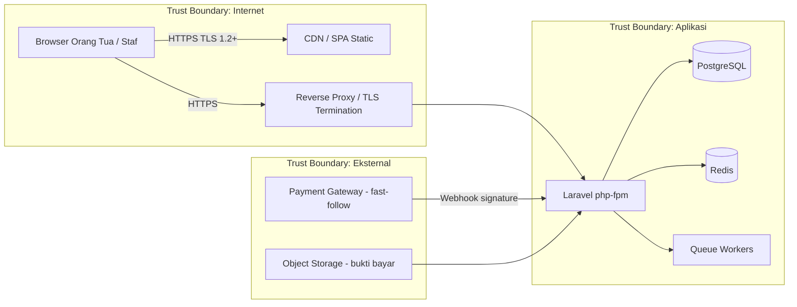

# SECURITY.md — Blueprint Keamanan Sistem (Cybersecurity by Design)

| | |
|---|---|
| **Versi** | 1.0 |
| **Status** | Active |
| **Tanggal** | 2026-08-28 |
| **Model ancaman** | STRIDE · **Referensi** | OWASP Top 10 (2021) · UU PDP No. 27/2022 (Indonesia) |
| **Lingkup** | Seluruh stack: React SPA → Laravel API → PostgreSQL/Redis → Infra VPS → CI/CD |

---

## 1. Prinsip Keamanan

1. **Security by Design** — kontrol ditanam di arsitektur & kode, bukan ditambal di akhir.
2. **Defense in Depth** — perlindungan berlapis; gagal satu lapis, ada lapis lain.
3. **Least Privilege** — setiap pengguna/service/container hanya punya akses minimal.
4. **Fail Secure** — default-nya tolak; kecuali eksplisit diizinkan.
5. **Minimasi PII** — data pribadi (murid/orang tua) dikumpulkan sesedikit mungkin, diakses sesedikit mungkin.
6. **Zero-trust antar tenant** — data sekolah A diperlakukan tidak pernah bisa diakses sekolah B.

---

## 2. Aset & Batas Kepercayaan

**Aset kritis:** data murid & orang tua (PII), data keuangan (invoice/payment/ledger), kredensial gateway & DB, key aplikasi, backup.

---

## 3. Threat Model (STRIDE)

| Kategori | Ancaman konkret di sistem ini | Mitigasi (lokasi kontrol) |
|---|---|---|
| **Spoofing** | Brute force login, token dicuri, webhook palsu | Rate-limit login, Sanctum token + expiry, verify signature webhook (ADR-0013) |
| **Tampering** | Ubah nominal invoice/payment, edit ledger, modif config sekolah | Integer cents + tarif dari master (bukan client), ledger **append-only** (ADR-0008), audit log, unique+lock di DB |
| **Repudiation** | Sangkalan "saya tidak bayar" / "saya tidak input" | Audit log siapa-kapan-apa, kuitansi sequential, maker-checker (pencatat ≠ verifikator) |
| **Information Disclosure** | PII siswa bocor, data sekolah lain terbaca, log bocor | TLS, tenant isolation (ADR-0005), RBAC+Policy, minimasi PII, masking di log, file bukti non-public |
| **Denial of Service** | Request flood, upload banjir, job queue overload | Rate limit (nginx + throttle Laravel), limit ukuran upload, resource limit container, retry queue terbatas |
| **Elevation of Privilege** | Role escalation, IDOR (akses resource milik orang lain), cross-tenant | RBAC (spatie) + Policy per resource, `school_id` dari konteks bukan request, Global Scope |
| **Financial Integrity** *(khusus domain kita)* | Double-charge, settle ganda, kuitansi dobel | Idempotency + unique constraint + lockForUpdate (ADR-0013), receipt_sequences terkunci |

---

## 4. Peta OWASP Top 10 (2021) → Kontrol di Sistem Ini

| OWASP | Kontrol kita | Artefak/implementasi |
|---|---|---|
| A01 Broken Access Control | RBAC + Policy + Global Scope tenant | `Middleware/Policy`, ADR-0005 |
| A02 Cryptographic Failures | TLS 1.2+, hash Argon2id, enkripsi secrets, backup terenkripsi | Nginx TLS, `APP_KEY`, `deploy/backup.sh` |
| A03 Injection | Query parameterized (Eloquent), validasi FormRequest | Eloquent ORM, FormRequest |
| A04 Insecure Design | Threat model ini + append-only + maker-checker | SECURITY.md, ADR-0008 |
| A05 Security Misconfiguration | Security headers, minimized image, non-root, least privilege | Nginx `default.conf`, Dockerfile |
| A06 Vulnerable Components | `composer audit` / `npm audit` di CI, Dependabot, pin versi | `.github/workflows/ci.yml` |
| A07 Auth Failures | Rate-limit, lockout, token expiry, reset password aman | Middleware throttle, Sanctum |
| A08 Integrity Failures | Verify signature webhook, signed/CI-tested image, no secrets in git | ADR-0013, CI |
| A09 Logging & Monitoring | Structured JSON log, Sentry, audit log, alert | `AuditLog`, Sentry |
| A10 SSRF | API tidak boleh fetch URL user; pasang allowlist bila perlu | Review di CODING_GUIDELINES |

---

## 5. Kontrol per Lapisan

### 5.1 Application Layer (Laravel)
- **Input:** semua lewat FormRequest — reject field tak dikenal, validasi tipe/panjang/format.
- **Output:** API Resource (shape terkontrol), escaping di frontend (React otomatis).
- **IDOR:** akses resource selalu lewat Policy + verifikasi kepemilikan tenant; jangan percaya `{id}` dari URL.
- **Mass assignment:** `$fillable` ketat; dilarang `$guarded = []`.
- **Rate limiting:** `throttle` pada login, payment, generate; nginx `limit_req` global.
- **Error handling:** error internal tidak membocorkan stack/query/path ke client; log mentah hanya di server/Sentry.
- **Upload bukti bayar:** allowlist MIME (jpeg/png/pdf), limit ukuran (10 MB), nama file random server-side, **tersimpan di storage non-public**, disajikan via route ber-auth, tidak pernah dieksekusi, ukuran gambar di-re-encode (hilangkan EXIF bila perlu).
- **Sesi:** Sanctum token via Bearer, `expires_at`, logout mem-blacklist token.

### 5.2 Authentication & Session
- Password: Argon2id (default Laravel), kebijakan minimal 10 karakter.
- Lockout setelah 5× gagal dalam 15 menit (dengan Redis counter).
- Reset password: token sekali pakai, TTL pendek, rate-limited.
- **Post-MVP (fast-follow):** MFA/TOTP untuk role bendahara & admin.

### 5.3 Authorization & Tenant Isolation
- RBAC `spatie/laravel-permission`: role `super-admin`, `admin`, `bendahara`, `walikelas`, `murid`, `ortua`.
- **Tenant scope tidak bisa di-spoof:** `school_id` dari konteks token/middleware, bukan body/param (ADR-0005).
- Test wajib: user sekolah A membaca sekolah B → 403/404.

### 5.4 Data Protection & Privacy (UU PDP 🇮🇩)
Data yang diproses = data pribadi murid & orang tua (nama, NIK/NIS, kontak, data pembayaran). Kewajiban sesuai **UU No. 27/2022 (berlaku efektif 17 Okt 2024)** yang kita jalankan secara praktis:
- **Minimisasi:** hanya kumpulkan data yang benar-benar dibutuhkan operasional.
- **Dasar pemrosesan:** kebutuhan kontrak layanan pendidikan + kepentingan sah; siapkan kebijakan privasi yang jelas.
- **Hak subjek data:** sediakan jalur murid/ortua untuk akses, koreksi, dan hapus data (fitur fast-follow; mekanisme internal sudah ada via data model).
- **Pembatasan akses & retensi:** siapa bisa lihat apa; hapus data sesuai ketentuan/permintaan.
- **Prosesor:** bila pakai vendor (hosting, Midtrans), pastikan kontrak pemrosesan data & cakupan data yang dikirim minimal (mis. Midtrans hanya order id + nominal + nama pembeli).
- **Notifikasi insiden:** siapkan alur pelaporan pelanggaran data (regulator + korban) sesuai ketentuan.

### 5.5 Network & Infrastructure
- Firewall UFW: hanya buka 22 (SSH), 80/443. DB/Redis **tidak expose ke publik** (hanya di network internal Docker).
- SSH: key-only, root login disabled, port 22 (atau custom dengan alasan), `fail2ban`.
- Container: jalankan **non-root user**, READ-ONLY file system untuk layer kode bila memungkinkan, `resource limits` (CPU/memori), `restart: unless-stopped`.
- Update keamanan otomatis (`unattended-upgrades`) untuk OS; image base di-pin dan di-update terjadwal.
- Secret software (gateway keys) disimpan **terenkripsi** (`APP_KEY` + kolom encrypted).

### 5.6 Pipeline & Supply Chain
- Secrets hanya di **GitHub Secrets / env server** — dilarang di repo, termasuk `.env` di commit (`.gitignore` wajib).
- CI menjalankan: `composer audit` + `npm audit`, lint format, test (Pest) dengan DB PostgreSQL nyata.
- Dependency: pin versi (`composer.lock` / `package-lock.json`), Dependabot aktif, image di-scan ringan (opsional: Trivy di CI).
- Build image dari hasil CI yang sudah di-test → deploy image yang sama (bukan "build di server").

### 5.7 Operational Security
- **Backup:** terenkripsi, retention 30 hari + bulanan, diuji-restore tiap bulan (RPO ≤ 24 jam, RTO ≤ 4 jam target MVP).
- **Monitoring:** `/healthz`, Sentry, uptime monitor, alert ke grup (telegram/WA).
- **Audit trail:** semua mutasi keuangan & aksi admin di `audit_logs` — immutable.
- **Akses server:** multi-user dengan SSH key terpisah; review siapa yang punya akses.

---

## 6. Keamanan Khusus Domain Keuangan

| Area | Kontrol |
|---|---|
| Pembayaran online (fast-follow) | Verify `signature_key` webhook; `UNIQUE(gateway_trx_id)`; nominal dari response gateway; **tidak pernah** percaya amount client (ADR-0013) |
| Pembayaran tunai | maker-checker; bukti tersimpan non-public; status `PENDING_VERIFICATION` bukan settlement otomatis |
| Ledger | append-only — koreksi via reversing entry (ADR-0008); saldo = agregasi, bukan kolom yang bisa diedit |
| Kuitansi | nomor sequential per sekolah+tahun via `lockForUpdate`; unik tanpa bolong |

---

## 7. Definisi "Rilis Aman" (Security Gate)

Sebuah fitur/PR dinyatakan AMAN jika lolos semua:
- [ ] Validasi input lengkap (FormRequest) — tidak ada field liar
- [ ] RBAC + Policy aktif untuk resource yang diakses
- [ ] Tenant isolation tidak dilewati (Global Scope utuh)
- [ ] Uang integer cents; nominal client tidak dipercaya untuk bank amount
- [ ] Mutasi keuangan lewat Action → tercatat audit
- [ ] Tidak ada secret/credential di kode/commit
- [ ] Query bebas N+1 (lapisan kinerja & DoS ringan)
- [ ] `composer audit` / `npm audit` bersih
- [ ] Test idempotency & isolasi tenant hijau
- [ ] Error tidak membocorkan detail internal
- [ ] File upload divalidasi (MIME/ukuran/nama/storage non-public)

Ceklis lengkap operasional ada di `CODING_GUIDELINES.md` §10.

---

## 8. Incident Response Plan (Dasar)

**Klasifikasi insiden:**
| Level | Contoh | Tindakan |
|---|---|---|
| P1 | Kebocoran data massal / akses tak sah ke data keuangan | Stop layanan (compose down) → containment → forensik → notifikasi (regulator+korban sesuai UU PDP) → pemulihan dari backup bersih |
| P2 | Anomali pembayaran / selisih ledger | Bekukan transaksi baru → rekonsiliasi vs laporan gateway → audit log → reversing entry jika terbukti salah |
| P3 | Akun staf dikompromikan | Revoke token, reset password, MFA (jika ada), review audit log aktivitas |

**Alur 6 langkah:** Deteksi → Contain → Eradicate → Recover → Lessons Learned → Dokumentasi ADR/runbook.

**Golden rule:** jangan pernah menghapus bukti; `ledger_entries` & `audit_logs` immutable justru alat investigasi kita.

---

## 9. Jadwal & Tanggung Jawab

- **Setiap milestone:** terapkan checklist §7; kode aman bukan pilihan, syarat.
- **M11 (hardening):** security review menyeluruh + penetration-test ringan manual + review akses server + uji restore backup.
- **Pasca go-live:** review keamanan kuartalan + perbarui threat model saat fitur baru (mis. saat integrasi Midtrans).
- **Siapa:** owner (solo) sebagai implementor, PM/arsitek (Hermes) sebagai reviewer & penjaga checklist.

---

## 10. Referensi

- OWASP Top 10 (2021) — https://owasp.org/Top10/
- UU No. 27 Tahun 2022 tentang Pelindungan Data Pribadi
- Keputusan arsitektur terkait: [ADR-0005](ADR/0005-multi-tenant-shared-db.md), [ADR-0008](ADR/0008-ledger-append-only.md), [ADR-0009](ADR/0009-money-integer-cents.md), [ADR-0013](ADR/0013-payment-idempotency.md)
- Infrastruktur & deployment: [DEVOPS.md](DEVOPS.md)
- Ceklis implementasi: [CODING_GUIDELINES.md](CODING_GUIDELINES.md)