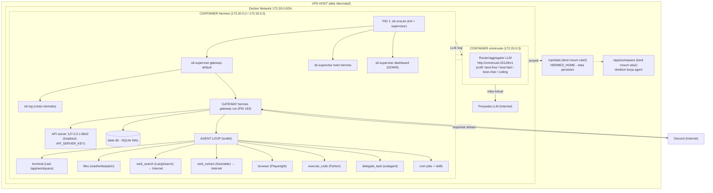

# Arsitektur Hermes di Server

> Dibuat: 2026-09-13 · Disusun dari inspeksi langsung di container `d686a231331d`
> Versi Hermes: `0.20.6` · Runtime: containerd + s6 (PID 1) · OS: Ubuntu Linux 6.8 x86_64
> Repo: https://github.com/fayzisme/keuangan-sekolah

## Diagram (Mermaid)

## Alur satu pesan (end-to-end)

1. Pesan dari Discord masuk ke Gateway via websocket.
2. Gateway cari sesi & memori user di `state.db`.
3. Prompt dirakit (konteks + skills + tool schemas) → dikirim ke Omniroute.
4. Omniroute memilih model terbaik per profil → diproses → balas.
5. Agent menjalankan tool loop (guardrails, redaction, kompresi konteks).
6. Respons akhir di-stream kembali ke Discord.
7. Semua tapak kaki tercatat oleh s6-log di `/opt/data/logs/gateways/default/`.

## Peta direktori & kepemilikan

### Di dalam container (image, overlayfs — VOLATIL)

| Path | Fungsi |
|---|---|
| `/opt/hermes` | Kode aplikasi: `agent/`, `gateway/`, `providers/`, `plugins/`, `tools/`, `skills/`, `web/` (UI), `tui_gateway/`. Python venv: `/opt/hermes/.venv`. |
| `/opt/hermes/docker/` | File entrypoint & service s6 (`main-wrapper.sh`, `s6-rc.d/...`). |

> ⚠️ Hilang saat image di-rebuild. Jangan simpan data penting di sini.

### Bind mount dari disk VPS (`/dev/vda2`) — PERSISTEN

| Path | Fungsi |
|---|---|
| `/opt/data` (= `HERMES_HOME`) | Semua data persisten Hermes (lihat tabel di bawah). |
| `/app/workspace` | Direktori kerja agent. Catatan: repo `keuangan-sekolah` yang aktif berada di `/opt/data/school-finance-system` (terhubung ke GitHub). |

### Isi `/opt/data` per komponen

| Direktori / File | Fungsi |
|---|---|
| `config.yaml` (+ `.bak*`) | Konfigurasi: model, database, security, plugins, platform |
| `.env` | Rahasia: token Discord, API keys (ter-redact otomatis) |
| `state.db` | DB utama (SQLite WAL): sesi, pesan, state |
| `sessions/` | Arsip riwayat percakapan |
| `memories/` | Memori jangka panjang + profil user |
| `gateway/` + `gateway.sock` + `gateway_state.json` | State & socket gateway, status platform |
| `state/` (`gateway.lifecycle.json`) | Lifecycle / fase gateway |
| `cron/jobs.json` | Jadwal job otomatis |
| `skills/` | Skills (devops, personal-finance, dll) |
| `plugins/` | `langsearch`, `discord-antispam` |
| `logs/gateways/default/` | Log gateway (dirotasi s6-log) |
| `kanban.db`, `projects.db`, `response_store.db`, `verification_evidence.db` | DB pendukung |
| `channel_directory.json`, `discord_threads.json` | State kanal/thread Discord |
| `backups/`, `plans/`, `hooks/`, `pairing/`, `sandboxes/` | Cadangan config, plan, hook, pairing, sandbox |
| `school-finance-system/` | Proyek `keuangan-sekolah` (repo git aktif) |
| `workspace/` | Direktori kerja kosong terpisah |

## Komponen & fungsinya

1. **s6-svscan (PID 1)** — init + supervisor: semua service diawasi, auto-restart saat crash, reaping zombie.
2. **Gateway (PID 163)** — jembatan platform (Discord) ↔ agent; API sendiri di loopback; state → SQLite.
3. **Agent loop** — toolkit kerja dengan guardrails, redaction, kompresi konteks.
4. **Omniroute (container terpisah)** — router LLM: pilih model per profil, fallback otomatis saat error.
5. **Discord gateway** — satu-satunya jalur masuk dari luar.
6. **s6-log** — log rotasi otomatis.
7. **Cron** — pekerja terjadwal (riset aset syariah bulanan).
8. **Dashboard** — slot ada tapi DOWN (`HERMES_DASHBOARD` kosong).

## Keamanan (terverifikasi)

- Inbound publik: **nol**. Semua koneksi keluar (Discord, Omniroute, LangSearch/Keenable).
- API server hanya di `127.0.0.1:8642` (+ `API_SERVER_KEY`).
- Secret redaction ON, Tirith pre-exec scan, command allowlist.
- `require_admin_for_exec_approval: true` untuk Discord.

## Backup

Lihat [panduan & skrip backup](./../ops/hermes-backup.md).